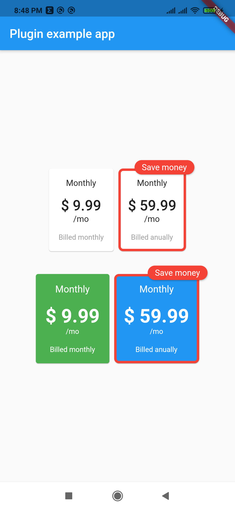

# pricing_cards

Awesome pricing cards for your flutter project.

## Example with all the parameters

The example:



The code with all possible parameters:

```dart
Column(
    mainAxisAlignment: MainAxisAlignment.center,
    children: [
        PricingCards(
            pricingCards: [
                PricingCard(
                title: 'Monthly',
                price: '\$ 9.99',
                subPriceText: '\/mo',
                billedText: 'Billed monthly',
                onPress: () {
                    // make your business
                },
                ),
                PricingCard(
                title: 'Monthly',
                price: '\$ 59.99',
                subPriceText: '\/mo',
                billedText: 'Billed anually',
                mainPricing: true,
                mainPricingHighlightText: 'Save money',
                onPress: () {
                    // make your business
                },
                )
            ],
        ),
        SizedBox(height: 30),
        PricingCards(
            pricingCards: [
                PricingCard(
                title: 'Monthly',
                price: '\$ 9.99',
                subPriceText: '\/mo',
                billedText: 'Billed monthly',
                onPress: () {
                    // make your business
                },
                cardColor: Colors.green,
                priceStyle: TextStyle(
                    fontSize: 32,
                    fontWeight: FontWeight.bold,
                    color: Colors.white,
                ),
                titleStyle: TextStyle(
                    fontSize: 16,
                    color: Colors.white,
                ),
                billedTextStyle: TextStyle(
                    fontSize: 12,
                    color: Colors.white,
                ),
                subPriceStyle: TextStyle(
                    fontSize: 12,
                    color: Colors.white,
                ),
                cardBorder: RoundedRectangleBorder(
                    side: BorderSide(color: Colors.red, width: 4.0),
                    borderRadius: BorderRadius.circular(8.0),
                ),
                ),
                PricingCard(
                title: 'Monthly',
                price: '\$ 59.99',
                subPriceText: '\/mo',
                billedText: 'Billed anually',
                mainPricing: true,
                mainPricingHighlightText: 'Save money',
                onPress: () {
                    // make your business
                },
                cardColor: Colors.blue,
                priceStyle: TextStyle(
                    fontSize: 32,
                    fontWeight: FontWeight.bold,
                    color: Colors.white,
                ),
                titleStyle: TextStyle(
                    fontSize: 16,
                    color: Colors.white,
                ),
                billedTextStyle: TextStyle(
                    fontSize: 12,
                    color: Colors.white,
                ),
                subPriceStyle: TextStyle(
                    fontSize: 12,
                    color: Colors.white,
                ),
                cardBorder: RoundedRectangleBorder(
                    side: BorderSide(color: Colors.red, width: 4.0),
                    borderRadius: BorderRadius.circular(8.0),
                ),
                )
            ],
        ),
    ],
)
```

## Help this project

Contributions are very welcome!
